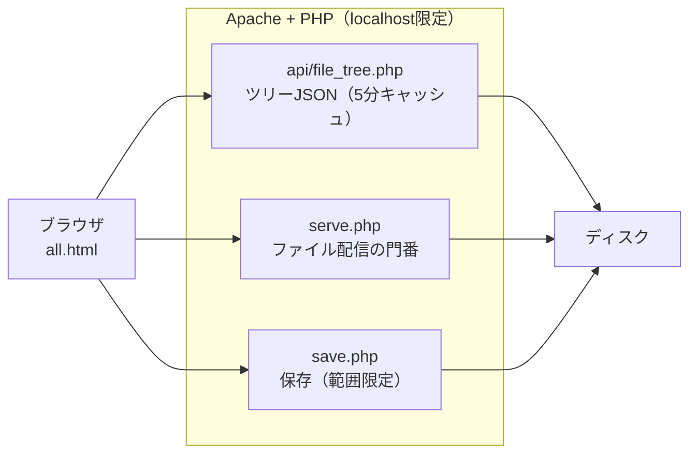

# hatohatoscope — ローカル作業フォルダビューア

**hatohatoscope（ハトハトスコープ）** — 鳩 + -scope（顕微鏡・望遠鏡と同じ「観察器具」）。
AIとの開発で膨らむ作業フォルダ全体を、人間が観察するための道具です。

A single-page local file viewer for your whole workspace: instant search over tens of
thousands of files, Markdown + Mermaid rendering, inline editing — served only to
`localhost` by design.

ブラウザひとつで、作業フォルダ全体を「見る・探す・開く・直す」ための1枚もののビューアです。
標準では XAMPP（Apache + PHP）で動きますが、サーバー側は小さな窓口が3つあるだけなので、
Flask など他の環境にも移植できます（後述「他の環境で動かす」）。**localhost 専用**に設計されています。

## なぜ作ったか — AIが増やす情報量と、増えない人間の認知

AIとの開発（バイブコーディング）は、コードだけでなく文書を量産します。
設計書・調査記録・実装メモ・READMEが毎日増え、個人開発でも情報量はチーム開発並みに膨らみます。

一方で、読む側の人間の認知能力は増えません。

- ワーキングメモリに一度に保持できるのは3〜4チャンク程度で、この容量は数十年の研究で変わらない定数です（Miller 1956; Cowan 2001）
- 同時に扱える情報チャネルは3〜4本が上限で、それを超えるとAI側がいくら適応しても人間の保持率は下がります（Frontiers in Psychology 2026）
- 「探す・切り替える」といった課題と無関係な負荷（外在的認知負荷）は、理解そのものを直接妨げます（Sweller 1988）
- 開発中のタスク中断は復帰に10〜60分かかり、自分でタブを探しに行く自己中断ほど破壊的です（Shakeri Hossein Abad et al. 2018）

エディタ（VS Code等）は「書く」ための道具で、この問題を解決してくれません。
Markdownを開けばコーディング中のタブが埋もれ、プレビューは手間で、深いツリーから目的のファイルを探すのは遅い。
結果、AIが書いた文書は読まれないまま死蔵します。

このビューアは「読む」を専用の1画面に分離することで、そのギャップを埋めます。

- **探す負荷を最小化** — ファイル名の一部を打てば数秒でターゲットに到達する
- **読む負荷を最小化** — Markdownは図（Mermaid）ごと描画された「読める」形で表示される
- **中断を最小化** — エディタのタブ状態を壊さない別画面。読み終えたらコーディングにそのまま戻れる

一言でいえば、**AIで増える情報量と、増えない人間の認知のあいだを埋める「読む」ための道具**です。

### 参考文献

- Miller, G. A. (1956). The magical number seven, plus or minus two. *Psychological Review*, 63(2), 81–97.
- Cowan, N. (2001). The magical number 4 in short-term memory. *Behavioral and Brain Sciences*, 24(1), 87–114.
- Sweller, J. (1988). Cognitive load during problem solving. *Cognitive Science*, 12(2), 257–285. https://doi.org/10.1207/s15516709cog1202_4
- Working memory in technology-enhanced language learning: a systematic review (2026). *Frontiers in Psychology*. https://www.frontiersin.org/journals/psychology/articles/10.3389/fpsyg.2026.1758104/full
- Shakeri Hossein Abad, Z. et al. (2018). Task Interruption in Software Development Projects. *EASE '18*. https://arxiv.org/abs/1805.05508

## できること

- **ツリー表示** — 作業フォルダ全体を左ペインにツリー表示。開閉状態・メニュー幅は記憶される
- **即時検索** — ファイル名の一部で全ファイルから即時検索（スペース区切りAND・相対パスでも可）。
  サーバー問い合わせ無しで、読込済みインデックスを絞るだけなので数ミリ秒
- **自動最新化** — 全体スキャンは重いので5分キャッシュ＋裏で自動再スキャン。
  新しく作ったファイルは「更新」を押さなくてもツリーに現れる
- **その場で表示** — Markdown（Mermaid対応）・PDF・画像・コード・diff の色付き表示
- **その場で編集** — テキスト系ファイルはブラウザ内で編集・保存
- **範囲の追加** — 許可リスト（`api/roots.php`）に書いたフォルダだけ、読み取り専用で追加できる

## 仕組み

- `serve.php` が許可フォルダ配下だけを配信する（`realpath` でリンク・`..` 抜けも検査）
- `save.php` はメインの作業フォルダ内の既存テキストファイルだけ上書きできる（新規作成は不可）
- ツリーと検索インデックスは同じJSONから作られるため、常に同期する

## セットアップ（Claude Code に任せる前提）

このリポジトリは、[Claude Code](https://claude.com/claude-code) などのAIコーディングエージェントに
セットアップさせる前提で書かれています。クローンしたフォルダで Claude Code を起動し、こう頼んでください。

> この README を読んで、このビューアを私の環境にセットアップして。

### セットアップ手順（Claude Code への指示。人間が手で行う場合も同じ）

1. **環境の確認** — ローカルでPHPが動くWebサーバーがあるか確認する。
   - XAMPP 等（Apache + PHP）があればそれを使う
   - 無ければ、下の「他の環境で動かす」のAPI仕様どおりに、その環境にあるスタック
     （Python / Node 等）でサーバー部を生成して構わない
2. **配置** — このフォルダをWebサーバーの公開フォルダ配下に置く（またはシンボリックリンク＋Alias）
3. **設定の作成** — `api/config.example.php` を `api/config.php` にコピーし、
   `root`（表示したい作業フォルダ）を利用者に確認して書き込む。
   追加の閲覧フォルダが必要なら `api/roots.example.php` → `api/roots.php` も同様に作る
4. **セキュリティ確認（必須）** — サーバーの待受が loopback（127.0.0.1 / ::1）限定であることを
   実測で確認する（`netstat` 等）。全インターフェース待受（0.0.0.0）なら必ず直す（下の⚠️参照）
5. **PlantUML図の描画（任意）** — .puml をその場で図にしたい場合は、Java を入れたうえで
   公式配布の plantuml.jar を `api/bin/plantuml.jar` に置く（無くても他機能は動く。
   その場合 .puml はソース表示になる）
6. **動作確認（これが完了条件）** — 次のすべてが通ったら完了：
   - `http://localhost/…/all.html` でツリーが表示される
   - ファイル名の一部を入力すると検索候補が出る
   - Markdownファイルが（Mermaid図ごと）描画される
   - LAN側アドレスからはポートに到達できない

## 他の環境で動かす（Flask・Node など）

画面（all.html）は静的な1枚もので、PHPには依存していません。
サーバーに求めるのは次の3エンドポイントだけです。同じ仕様で実装すれば、どのスタックでも動きます。

| エンドポイント | 入力 | 返すもの |
|---|---|---|
| `GET api/file_tree.php?root=1`（`&fresh=1`で強制再スキャン） | なし | ツリーのJSON `{name, path, children[], size}`。キャッシュ応答時はヘッダ `X-Cache: HIT` |
| `GET serve.php?p=<絶対パス>` | ファイルの絶対パス | ファイル本体（適切なContent-Type）。範囲外は403、フォルダは404で本文 `not a file` |
| `POST save.php`（`p`, `body`） | パスと新しい本文 | 成功 `OK: <n> bytes saved`、失敗は403/404/415と理由 |

移植のポイント：

- `path` は OSの絶対パス文字列をそのまま使う（フロントはパスを解釈せず表示・受け渡しのみ）
- 配信・保存の**許可範囲チェックは必ずサーバー側に置く**（serve.php / save.php の検査の流れを踏襲）
- all.html 側は、内部の3つのURL文字列（`api/file_tree.php`・`serve.php`・`save.php`）を差し替えるだけ

この節と既存のPHP3ファイルを Claude Code などのAIコーディングエージェントに渡せば、
Flask / FastAPI / Node 版のサーバー部を短時間で生成できます（そのための仕様書としてこの節を書いています）。

## ⚠️ セキュリティ上の前提（重要）

このツールには**認証がありません**。「このPC自身からしか届かない」ことだけが守りです。

- Apache は必ず **loopback 限定**で待ち受けること：
  - `httpd.conf` → `Listen 127.0.0.1:80` （`Listen 80` にしない）
  - `httpd-ssl.conf` → `Listen 127.0.0.1:443`
- `Listen 80`（全インターフェース）のまま使うと、同じネットワークの他端末から
  認証なしでファイルを読み書きされうる。**LAN公開・ポート開放は絶対にしない**
- 外部からアクセスしたい場合は、このツールを開放するのではなく、認証付きの仕組み（VPN等）を別途設計すること

## 動作環境

Windows + XAMPP（Apache 2.4 / PHP 8）で開発・使用。ブラウザは Chrome で確認。
