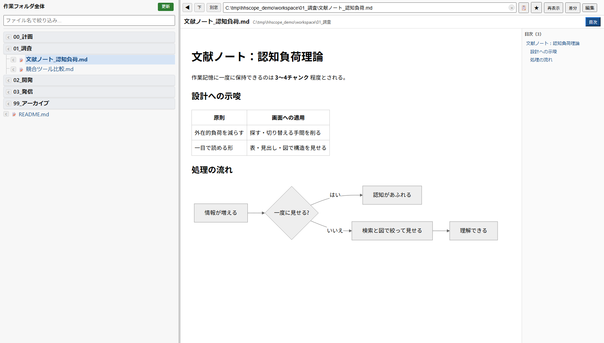
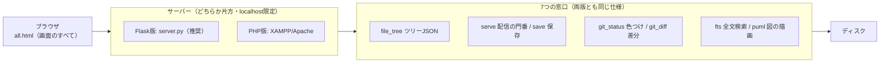

# hatohatoscope — ローカル作業フォルダビューア


**hatohatoscope（ハトハトスコープ）** — 鳩 + -scope（観察器具）。
AIとの開発で膨らむ作業フォルダ全体を、ブラウザひとつで「見る・探す・開く・直す」ための1枚もののビューアです。

A single-page local file viewer for your whole workspace: instant filename search,
full-text search, Markdown + Mermaid + PlantUML rendering, inline editing — served
only to `localhost` by design.



## クイックスタート（Python + Flask）

```
git clone https://github.com/hatohato-lab/hatohatoscope.git
cd hatohatoscope
copy api\config.example.json api\config.json   ← root を自分の作業フォルダに書き換える
pip install flask
python server.py
```

ブラウザで `http://localhost:8765/all.html` を開けば動きます。
サーバーは **Flask版（server.py・推奨）** と **PHP版（XAMPP/Apache）** の2つを同梱しており、
画面（all.html）は共通です。どちらも **localhost 専用**です。

## できること

| 機能 | 内容 |
|---|---|
| ツリー表示 | 作業フォルダ全体を左にツリー表示。開閉・幅・表示位置は記憶される |
| ファイル名検索 | 名前の一部で即時検索（AND・相対パス可）。読込済み索引を絞るだけなので数ミリ秒 |
| 本文の全文検索 | 候補の最後の「🔎 本文を検索」で md/html の中身から探す（索引方式・0.3秒） |
| その場で表示 | Markdown（Mermaid対応）・PDF・画像・diff・コードの色付き表示＋目次ペイン |
| PlantUML描画 | .puml を開くとローカルの plantuml.jar でその場SVG化（外部送信なし・任意） |
| その場で編集 | テキスト系ファイルはブラウザ内で編集・保存。「再表示」で最新を読み直し |
| gitの見える化 | 変更ファイルをツリーで色分け（変更=橙・新規=緑）。±ボタンで差分を色付き表示 |
| ブックマーク | よく使うファイル・フォルダを上部に固定 |
| まとまり順ソート | フォルダ→分類の対応表（Markdownの表）を設定すると、意味のまとまり順に並べ替え |
| 範囲の追加 | 許可リストに書いたフォルダだけ、読み取り専用で閲覧範囲に追加 |
| 自動最新化 | 全体スキャンは5分キャッシュ＋裏で自動再スキャン。新しいファイルも自動で載る |

## 仕組み



- 配信（serve）は許可フォルダ配下だけ。`realpath` でリンク・`..` 抜けも検査する
- 保存（save）はメインの作業フォルダ内の既存テキストファイルだけ（新規作成は不可）
- ツリーと検索索引は同じJSONから作られるため、常に同期する

## セットアップの詳細

このリポジトリは、[Claude Code](https://claude.com/claude-code) などのAIコーディングエージェントに
セットアップさせる前提でも書かれています。クローンしたフォルダでこう頼めば動きます。

> この README を読んで、このビューアを私の環境にセットアップして。

### 方法A: Flask（推奨・いちばん簡単）

上のクイックスタートのとおり。追加の閲覧フォルダが必要なら
`api/roots.example.json` → `api/roots.json` も同様にコピーして書く。

### 方法B: XAMPP（Apache + PHP）

| 手順 | 内容 |
|---|---|
| 1. 配置 | このフォルダを公開フォルダ配下に置く（またはシンボリックリンク＋Alias） |
| 2. 設定 | `api/config.example.php` → `api/config.php` にコピーし、root を書き換える |
| 3. 安全確認（必須） | 待受が 127.0.0.1 限定であることを `netstat` で実測確認（下の⚠️参照） |

### 共通の追加設定と動作確認

- **PlantUML図の描画（任意）** — Java を入れ、公式配布の plantuml.jar を
  `api/bin/plantuml.jar` に置く（無くても他機能は動く。その場合 .puml はソース表示）
- **動作確認（完了条件）** — ツリーが出る／名前検索の候補が出る／Markdownが図ごと描画される／
  LAN側アドレスからは到達できない、の4つが通れば完了

## 他の環境で動かす（Node など）

画面（all.html）は静的な1枚もので、サーバーの言語に依存しません。
同梱の `server.py`（Flask）がそのまま参照実装です。中核は次の3エンドポイントで、
同じ仕様で実装すればどのスタックでも動きます。

| エンドポイント | 入力 | 返すもの |
|---|---|---|
| `GET api/file_tree.php?root=1`（`&fresh=1`で強制再スキャン） | なし | ツリーのJSON `{name, path, children[], size}`。キャッシュ応答時はヘッダ `X-Cache: HIT` |
| `GET serve.php?p=<絶対パス>` | ファイルの絶対パス | ファイル本体（適切なContent-Type）。範囲外は403、フォルダは404で本文 `not a file` |
| `POST save.php`（`p`, `body`） | パスと新しい本文 | 成功 `OK: <n> bytes saved`、失敗は403/404/415と理由 |

移植のポイント：

- `path` はOSの絶対パス文字列をそのまま使う（画面側はパスを解釈しない）
- 配信・保存の**許可範囲チェックは必ずサーバー側に置く**
- all.html 側は内部のURL文字列を差し替えるだけ

## ⚠️ セキュリティ上の前提（重要）

このツールには**認証がありません**。「このPC自身からしか届かない」ことだけが守りです。

- Flask版は `server.py` の `host='127.0.0.1'` を変えない
- Apache は必ず loopback 限定で待ち受ける（`Listen 127.0.0.1:80`。`Listen 80` にしない）
- **LAN公開・ポート開放は絶対にしない**。外から見たい場合は認証付きの仕組み（VPN等）を別途設計する

## なぜ作ったか — AIが増やす情報量と、増えない人間の認知

AIとの開発（バイブコーディング）は、コードだけでなく文書を量産します。
設計書・調査記録・実装メモが毎日増え、個人開発でも情報量はチーム開発並みに膨らみます。
一方で、読む側の人間の認知能力は増えません。

- ワーキングメモリに一度に保持できるのは3〜4チャンク程度（Miller 1956; Cowan 2001）
- 同時に扱える情報チャネルは3〜4本が上限（Frontiers in Psychology 2026）
- 「探す・切り替える」という課題と無関係な負荷は、理解そのものを直接妨げる（Sweller 1988）
- 開発中のタスク中断は復帰に10〜60分かかる（Shakeri Hossein Abad et al. 2018）

エディタ（VS Code等）は「書く」ための道具で、この問題を解決してくれません。
このビューアは「読む」を専用の1画面に分離し、探す・読む・中断の負荷を最小化します。
一言でいえば、**AIで増える情報量と、増えない人間の認知のあいだを埋める「読む」ための道具**です。

### 参考文献

- Miller, G. A. (1956). The magical number seven, plus or minus two. *Psychological Review*, 63(2), 81–97.
- Cowan, N. (2001). The magical number 4 in short-term memory. *Behavioral and Brain Sciences*, 24(1), 87–114.
- Sweller, J. (1988). Cognitive load during problem solving. *Cognitive Science*, 12(2), 257–285. https://doi.org/10.1207/s15516709cog1202_4
- Working memory in technology-enhanced language learning: a systematic review (2026). *Frontiers in Psychology*. https://www.frontiersin.org/journals/psychology/articles/10.3389/fpsyg.2026.1758104/full
- Shakeri Hossein Abad, Z. et al. (2018). Task Interruption in Software Development Projects. *EASE '18*. https://arxiv.org/abs/1805.05508

## 動作環境

Windows + XAMPP（Apache 2.4 / PHP 8）および Python 3 + Flask で開発・使用。ブラウザは Chrome で確認。
